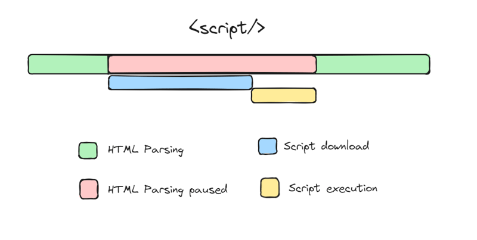
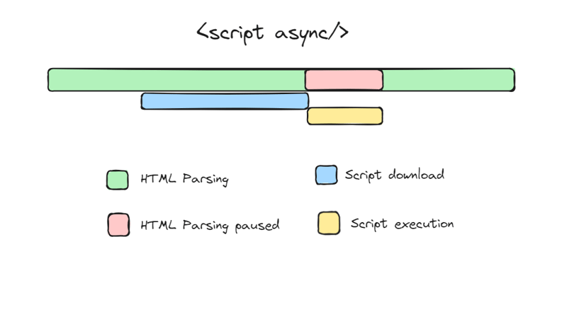
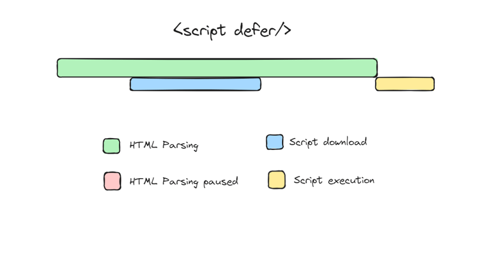

#### Q. What is React? Why React is known as ‘React’?

    React is a JavaScript Library. The name ‘React’ was chosen
    because the library was designed to allow developers to react
    to changes in state and data within an application, and to
    update the user interface in a declarative and efficient
    manner.

#### Q. What is Emmet?

    Emmet is the essential toolkit for web-developers. It allows you
    to type shortcuts that are then expanded into full-fledged boiler plate code for writing HTML and CSS.

#### Q. What is crossorigin in script tag?

    The crossorigin attribute in the script tag enables CrossOrigin Resource Sharing (CORS) for loading external JavaScript
    files from different origin than the hosting web page. This
    allows the script to access resources from the server hosting
    the script, such as making HTTP requests or accessing data.

#### Q. What is async and defer in script tag? [explanation](https://www.youtube.com/watch?v=IrHmpdORLu8)

Default ``

Async ``

Defer ``

### IMPORTANT NOTES:

#### 1. React will overwrite everything inside "root" and replaces with whatever given inside render.
